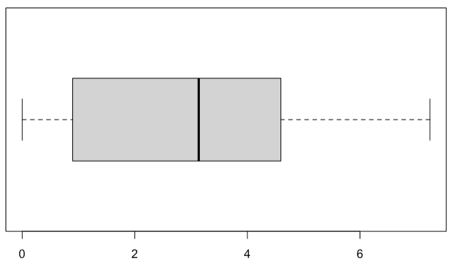

# About

- **883** unique patients, **970** unique episodes, **973** unique data-points

  - **547** males, age summary:

   

  - **336** females, age summary:

   

- Ketones:

| Ketones > | Count (total=973) | %age | Lower Bound | Upper Bound |
| :-------: | :---------------: | :--: | :---------: | :---------: |
|    1.0    |        20         | 2.06 |    1.16     |    2.95     |
|    0.6    |        52         | 5.34 |    3.93     |    6.76     |

- Blood sugar levels:

|       BSL level       | Count (total=973) | %age | Lower Bound | Upper Bound |
| :-------------------: | :---------------: | :--: | :---------: | :---------: |
|  Hypoglycaemia (< 5)  |        55         | 5.65 |     4.2     |     7.1     |
| Hyperglycaemia (> 15) |        36         | 3.7  |    2.51     |    4.89     |

# Diabetic Management

Drug managed diabetes:

|   Patient on drug (_name_)   | Count | %age  | Lower Bound | Upper Bound |
| :--------------------------: | :---: | :---: | :---------: | :---------: |
|       Insulin - Rapid        |  152  | 15.62 |    13.34    |    17.9     |
|       Insulin - Short        |   5   | 0.51  |    0.06     |    0.96     |
|    Insulin - Intermediate    |  110  | 11.31 |    9.32     |    13.29    |
|        Insulin - Long        |  138  | 14.18 |    11.99    |    16.38    |
|            SGLT2i            |  122  | 12.54 |    10.46    |    14.62    |
|          Metformin           |  622  | 63.93 |    60.91    |    66.94    |
|        Sulphonylurea         |  189  | 19.42 |    16.94    |    21.91    |
|      Thiazolidinediones      |   8   | 0.82  |    0.25     |    1.39     |
|         Meglitinides         |   2   | 0.21  |    -0.08    |    0.49     |
| Alpha glucosidase inhibitors |   3   | 0.31  |    -0.04    |    0.66     |
|       DPP4 inhibitors        |  177  | 18.19 |    15.77    |    20.62    |
|        GLP1 agonists         |  25   | 2.57  |    1.58     |    3.56     |

**Note**: No patient out of the selected 973 data-points fasted greater than 24 hours.

Modified John Hopkins surgical criteria:

| Procedure Grade | Count | %age  | Lower Bound | Upper Bound |
| :-------------: | :---: | :---: | :---------: | ----------- |
|        1        |  740  | 76.92 |    74.26    | 79.59       |
|        2        |  171  | 17.78 |    15.36    | 20.19       |
|        3        |  51   | 5.30  |    3.89     | 6.72        |

Endoscopy:

|            classes             | Count | percentage | lowerBound | upperBound |
| :----------------------------: | :---: | :--------: | :--------: | :--------: |
| both colonoscopy + gastroscopy |  39   |    4.01    |    2.78    |    5.25    |
|       colonoscopy alone        |  81   |    8.33    |    6.60    |   10.07    |
|       gastroscopy alone        |  37   |    3.81    |    2.60    |    5.01    |
|         not endoscopy          |  815  |   83.85    |   81.53    |   86.16    |

# Diagnosis

Charlson co-morbidity index, on admission - treated as a continuous variable on context of score:

|   mean   | standardDeviation |
| :------: | :---------------: |
| 1.959491 |     1.323459      |

Clavien Dindo III | IV:

| Clavien Dindo III IV | Count (total=973) | %age | Lower Bound | Upper Bound |
| :------------------: | :---------------: | :--: | :---------: | :---------: |
|         YES          |        75         | 7.72 |    6.04     |    9.39     |

ICU admissions of which average length of stay in ICU > 24:

| ICU visit | Count (total=973) | %age | Lower Bound | Upper Bound |
| :-------: | :---------------: | :--: | :---------: | :---------: |
|    YES    |        24         | 2.47 |    1.49     |    3.44     |

Post-op length of stay:

|   mean   | standardDeviation |
| :------: | :---------------: |
| 49.42647 |     131.3018      |

**Note:**

- **30.88**% [27.95 - 33.82] of patients have length of stay in hospital greater than 24hours (**97**% of which have their vitals recorded)
- **30.04**% [27.16 - 32.92] of patients have length of stay > 24 hours and have vitals data recorded
- From the vitals recorded for entire cohort of 979 patient visits, **51.48**% [48.35 - 54.61] of it is missing
- **57.9**% (567/979) of data have complete cases that is all data is available for any kind of analytics.

# MET

Breach of MET call criteria:

|     Parameter     | Count (total=973) | %age | Lower Bound | Upper Bound |
| :---------------: | :---------------: | :--: | :---------: | :---------: |
| Post-op MET calls |        71         | 7.3  |    5.66     |    8.93     |

Vital readings breach _**duration**_:

| Parameter                                     | Mean (minutes) | SD (minutes) |
| --------------------------------------------- | -------------- | ------------ |
| MET Breach duration : Pulse Rate              | 190.6338       | 666.261      |
| MET Breach duration : Respiratory Rate        | 111.507        | 315.0723     |
| MET Breach duration : SpO2                    | 117.3944       | 302.0485     |
| MET Breach duration : Systolic Blood Pressure | 137.9859       | 565.7985     |
| MET Breach duration : Temperature             | 0              | 0            |

# UCR

Breach of UCR criteria:

|           Parameter           | Count (total=973) | %age  | Lower Bound | Upper Bound |
| :---------------------------: | :---------------: | :---: | :---------: | :---------: |
| Post-op UCR criteria breaches |        232        | 23.84 |    21.17    |    26.52    |

Vitals breaching UCR criteria _**duration**_:

| Parameter                                     | Mean (minutes) | SD (minutes) |
| --------------------------------------------- | -------------- | ------------ |
| UCR Breach duration : Pulse Rate              | 1777.522       | 17511.79     |
| UCR Breach duration : Respiratory Rate        | 59.88793       | 272.8882     |
| UCR Breach duration : SpO2                    | 558.2414       | 1359.91      |
| UCR Breach duration : Systolic Blood Pressure | 2094.888       | 21188.35     |
| UCR Breach duration : Temperature             | 151.2759       | 456.6385     |

# Modelling

- Note: I have used and compared Generalised linear models (GLM) and Generalised Additive models (GAM) in my analysis, here is why: The main difference b/w them is that while "classical" forms of linear, or generalized linear, models assume a fixed linear or some other parametric form of the relationship between the dependent variable and the covariates, while GAMs do not assume a priori any specific form of this relationship, and can be used to reveal and estimate non-linear effects of the covariate on the dependent variable. 

## Outcome: Ketones > 1.0

### **Predictors**

Only look at Pre-operative risk factors for development of ketosis:

- Duration fasting (continuous)

- Colonoscopy vs not (binary)

- Insulin use (binary)

- Gliflozin use (binary)

- DPP4 use (binary)?

- GLP1 agonist use (binary)?

- HbA1c (continuous)

### Models

#### Multivariate Logistic regression - only solid food duration

 

#### Multivariate Logistic regression - solid, liquid, high calorie

 

#### Inference

- Intercept and CLASS_COLONOSCOPY_YES are significant features in the model.

- A patient who has undergone Colonoscopy is 9.3 times more susceptible of having Ketones > 1 rather than a person who does not undergo Colonoscopy.

- Model can be defined as: 0.01981066 + 1.00889999.FOOD_SOLID_DURATION + 9.33365348.CLASS_COLONOSCOPY_YES + 0.53696205.CLASS_INSULIN_USE_YES + 0.50842367.SURGERY_MED_GliflozinYES + 1.41621495.SURGERY_MED_DPP4_inhibitors_YES + 7.08092643.SURGERY_MED_GLP1_agonist_YES + 0.99725666.PRE_OP_6M_LATEST_HBA1C
- Comparing:

 

From the above we can conclude that the model with liquid fasting and high calorie indicator does not lead to a significant improved fit over the model with just solid food fasting - as the p-value > 0.05 (we fail to reject the null hypothesis that the null model is aptly fitting the data) and adding the new variables just decreases the degrees of freedom by 2 and deviance by just 3.7 so these features dont contribute much information to the model. In a way we can interpret this as the knowledge of how long a patient fasted for liquid foods and whether they were high in calorie or not does not help much in ascertaining whether ketones for that patient will be high.

## Outcome: Ketones > 0.6

### **Predictors**

Only look at Pre-operative risk factors for development of ketosis:

- Duration fasting (continuous)

- Colonoscopy vs not (binary)

- Insulin use (binary)

- Gliflozin use (binary)

- DPP4 use (binary)?

- GLP1 agonist use (binary)?

- HbA1c (continuous)

### Models

#### Multivariate Logistic regression - only solid food duration

  

#### Multivariate Logistic regression - solid, liquid, high calorie

  

#### Inference

- Intercept and CLASS_COLONOSCOPY_YES (both at 99.9% significance level) and SURGERY_MED_GLP1_agonist_YES (at 90% significance level) are significant features in the model. A patient who has undergone Colonoscopy is 17.37 times more susceptible of having Ketones > 0.6 rather than a person who does not undergo Colonoscopy, similarly a patient who is on Glp1 agonists is 8.5 times more susceptible of having ketones > 0.6

- Model can be defined as: 0.01981066 + 1.00889999.FOOD_SOLID_DURATION + 9.33365348.CLASS_COLONOSCOPY_YES + 0.53696205.CLASS_INSULIN_USE_YES + 0.50842367.SURGERY_MED_GliflozinYES + 1.41621495.SURGERY_MED_DPP4_inhibitors_YES + 7.08092643.SURGERY_MED_GLP1_agonist_YES + 0.99725666.PRE_OP_6M_LATEST_HBA1C
- Comparing:

  

Again, as the p-value > 0.05 (we fail to reject the null hypothesis that the null model is aptly fitting the data) and adding the new variables just decreases the degrees of freedom by 2 and deviance by just 2.8 so these features dont contribute much information to the model. In a way we can interpret this as the knowledge of how long a patient fasted for liquid foods and whether they were high in calorie or not does not help much in ascertaining whether ketones for that patient will be high.

## Outcome: Outcome Clavien III/ IV

### **Predictors**

- Charlsson comorbidity index (continuous)
  + Ketone (continuous or binary)
  + Age (continuous)
  + Modified johns Hopkins (ordinal)
  + Emergency (binary)
  + Albumin (continuous)
  + Hb (continuous)
  + eGFR (continuous)

### Models

#### Multivariate Logistic regression

 

Check whether the model is making sense better than the null model

 

As the p-value of the second model i.e. full model is signifcant (< 0.05) we reject the null hypothesis that the null model is okay.
- This means that addding the new variables do contribute in improving the predictive performance of the model.
Adding the new variables decreases the degrees of freedom by 9 and deviance by 26.5 which is substantial.

#### Inference

- Intercept, age and latest Hb pathology result are significant features at 95% in the model.
- PROCEDURE_GRADE is being treated as an ordinal response with levels 1<2<3 and only fixed effects are taken into consideration.

## Outcome: Ketones

Only look at Pre-operative risk factors for development of ketosis

### **Predictors**

- Duration fasting (continuous)
- Colonoscopy vs not (binary)
- Insulin use (binary)  
   - Gliflozin use (binary)
   - GLP1 agonist use (binary)?
   - HbA1c (continuous)
   - DPP4 use (binary)?

### Models

#### Linear regression

   

Check whether the model is making sense better than the null model

   

As the p-value of the second model i.e. full model is signifcant (< 0.05) we reject the null hypothesis that the null model is okay.

#### GAM

 

Colonoscopy, use of GLP1 agonists, Solid food fasting and latest HbA1c prove to be significant in determining ketones a patient may have.

Comparing the linear model with the generalised additive model:

 

#### Inference

| Model                      | Deviance | AIC   |
| -------------------------- | -------- | ----- |
| Linear Regression          | 56.9     | 323.6 |
| Generalised Additive Model | 45.6     | 231.6 |

From the above analysis we can see that the GAM performs better at fitting the data, ANOVA is not an ideal comparision of the 2 models but there is a good reduction in Deviance and AIC which compels me to favor the GAM model at fitting the data a bit more. AIC was chosen because we are comparing 2 very different kinds of models but with same predictors.

## Outcome: Length of Stay (LOS)  _Hours_

Excluding COLONSCOPY

### **Predictors**

- Charlson co-morbidity index (continuous)
- Ketone (continuous or binary)
- Age (continuous)
- Modified johns Hopkins (ordinal)
- Emergency (binary)
- Albumin (continuous)
- Hb (continuous)
- eGFR (continuous)

Check distribution of LOS in hours:

 

Seeing a lot of outliers here, ideally testing out log transform on response variable (LOS here):

 

### Models

#### Linear regression

    

- The full linear model with specified predictors is a better fit than just the null model.

- Procedure Grade 2, latest serum albumin and whether the surgery is an emergency or not play a signifcant role in determining the lost of stay of patients post-op.

As the p-value of the second model i.e. full model is signifcant (< 0.05) we reject the null hypothesis that the null model is okay.
- This means that addding the new variables do contribute in improving the predictive performance of the model.

#### Normal GAM

 

#### Log Transformed GAM

 

#### Inference

We can see which variable is more signifcant based on the model summary above, interesting thing to note is that the log transformed model fits the data better and the signifance of same variables differ in different models.

Comparing the linear model with the generalised additive model: 

| Model                                        | Deviance | AIC      |
| -------------------------------------------- | -------- | -------- |
| Linear Regression                            | 10734876 | 5848.854 |
| Generalised Additive Model                   | 10321253 | 5845.321 |
| Generalised Additive Model - Log Transformed | 795.87   | 1567.254 |

PROCEDURE_GRADE is being treated as an ordinal response with levels 1<2<3 and only fixed effects are taken into consideration.

Comparing null model with full model for the GAM:

 

p-value << 0.05, reject the null hypothesis (model), the full model selected fits the data better than the null model.

From the above analysis we can see that the GAM performs better at fitting the data, there is a good reduction in Deviance and AIC which compels me to favor the GAM model at fitting the data a bit more.
